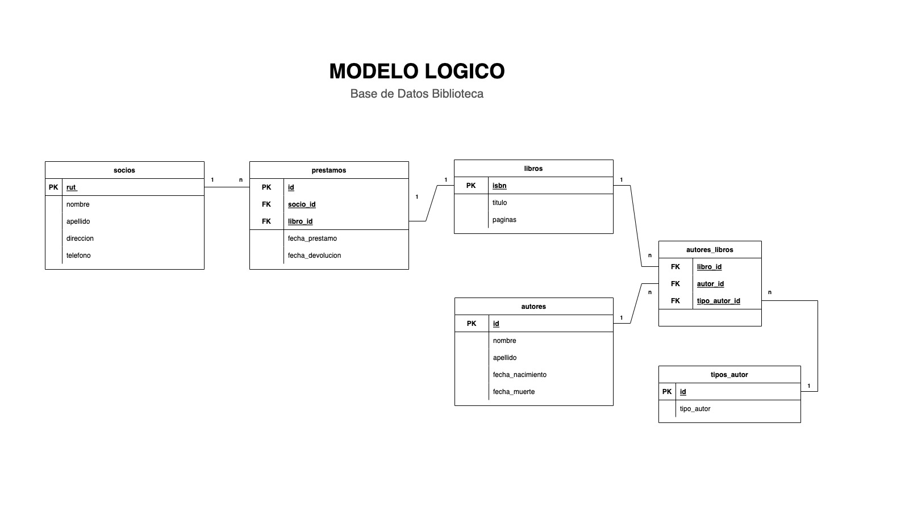
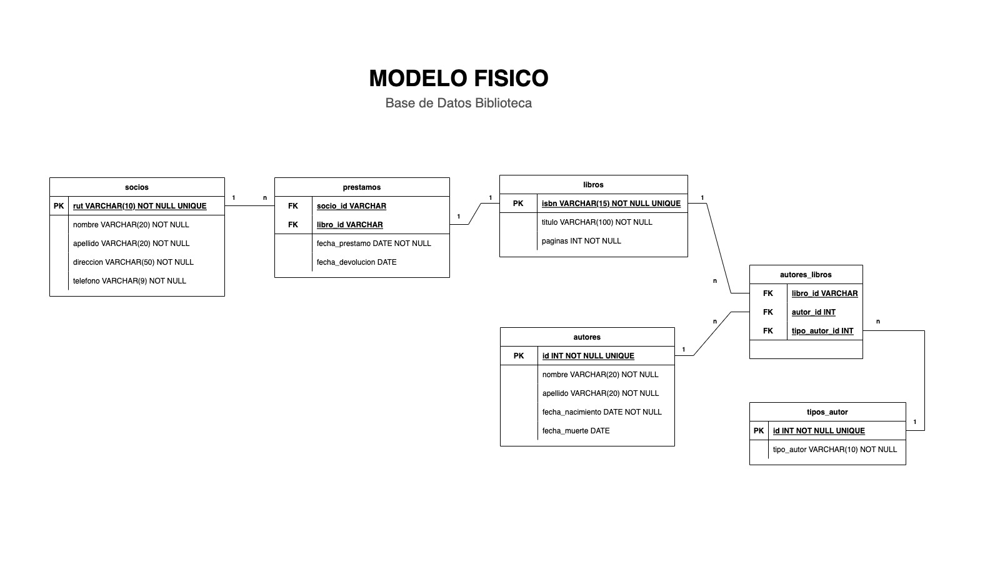

## Prueba Biblioteca

### Parte 1

1. Realizar el modelo conceptual, considerando las entidades y relaciones entre ellas.(1 Punto)
   
2. Realizar el modelo lógico, considerando todas las entidades y las relaciones entre ellas, los atributos, normalización y creación de tablas intermedias de ser necesario. (2 Puntos)
   
3. Realizar el modelo físico, considerando la especificación de tablas y columnas, además de las claves externas. (2 Puntos)
   

### Parte 2

1. Crear el modelo en una base de datos llamada biblioteca, considerando las tablas definidas y sus atributos. (2 puntos).

2. Se deben insertar los registros en las tablas correspondientes (1 punto).
3. Realizar las siguientes consultas:
   a. Mostrar todos los libros que posean menos de 300 páginas. (0.5 puntos)
   b. Mostrar todos los autores que hayan nacido después del 01-01-1970. (0.5 puntos)
   c. ¿Cuál es el libro más solicitado? (0.5 puntos).
   d. Si se cobrara una multa de $100 por cada día de atraso, mostrar cuánto debería pagar cada usuario que entregue el préstamo después de 7 días.(0.5 puntos)
